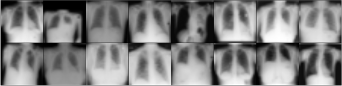

# Chest-Xray-Classification


This repo studies the effect of ImageNet pre-training and how far it can extend the applicability of Vision Transformers (ViTs) in the medical domain. To this end, we designed several experiments that utilize different settings and provide the __AUROC__ metric for the `n_trials` of each run.

1. Why __AUROC__? 
   - Insensitive to class imbalance: AUROC is a useful metric when dealing with imbalanced datasets, where the number of positive and negative instances differs significantly. It focuses on the classifier's ability to rank positive instances higher than negative instances, regardless of the class distribution.
   - Threshold-independent: AUROC considers the classifier's performance across all possible classification thresholds. It provides a single aggregated measure of performance without requiring a specific threshold selection.


This repository contains the following files and directories:

- `README.md`: The main README file providing an overview of the repository.
- Directory containing the source code files.
  - `train_test.py`: The main Python script for the project.
  - `experiments.py`: Run all experiments at once.
  - `utils.py`: Utility functions used by the main script.
  - `models.py`: Creates the model by using the [timm module](https://timm.fast.ai/).
  - `dataloader.py`: Dataloader scripts for diverse Chest X-ray datasets.
  - `medmnist_test.py`: Test script with ChestMNIST dataset, equivalent to ChestXray14, to lessen the GPU needs while developing code.
- `requirements.txt`: Requirement libraries to use this repo.
- `.gitignore`: File specifying which files to ignore in version control.

# Updates
- [x] Create a model's with timm.
- [x] Create a dataloader for [ChestXray14](https://www.cc.nih.gov/drd/summers.html) and [ChestMNIST](https://medmnist.com/) from the [MedMNIST](https://www.nature.com/articles/s41597-022-01721-8) datasets.
- [ ] Create a dataloader for [JSRT](http://db.jsrt.or.jp/eng.php) dataset.

---
Run scripts as follows:

```bash
python experiments.py \
--dataset_name ChestXray14 \
--dataset_path /path/to/dataset \
--batch_size 24 \
--epochs 100 \
--num_trial 5 \
--in_chans 3 \
```
---

```bash
python train_test.py \
--dataset_name ChestXray14 \
--model_name resnet18 \
--dataset_path /path/to/dataset \
--normalization imagenet \
--batch_size 24 \
--lr 0.01 \
--epochs 100 \
--num_trial 10 \
--in_chans 3 \
--train_list ./Xray14_train_official.txt \
--val_list ./Xray14_val_official.txt \
--test_list ./Xray14_test_official.txt
```